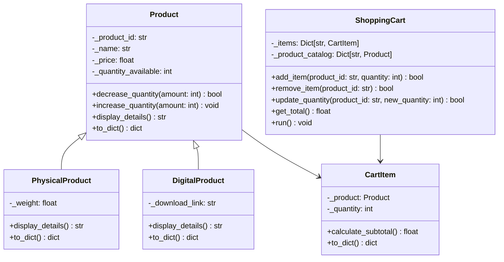

# 🛒 Online Shopping Cart System

A sophisticated Python-based shopping cart application with product catalog management, persistent cart state, and support for both physical and digital products. This object-oriented solution demonstrates modern software design principles with real-world e-commerce functionality.

## ✨ Features

### 🏪 Product Management
- **Multiple Product Types**: Support for physical, digital, and generic products
- **Inventory Tracking**: Real-time quantity management with stock validation
- **Product Catalog**: JSON-based persistent storage with automatic loading
- **Detailed Product Information**: Comprehensive product details with type-specific attributes

### 🛍️ Shopping Cart Functionality
- **Add/Remove Items**: Seamless cart management with inventory synchronization
- **Quantity Updates**: Dynamic quantity adjustments with stock validation
- **Persistent Cart State**: Automatic saving and restoration of cart contents
- **Real-time Calculations**: Instant subtotal and grand total computations

### 🎯 Advanced Features
- **Object-Oriented Design**: Clean inheritance hierarchy with proper encapsulation
- **Type Safety**: Comprehensive type hints throughout the codebase
- **Error Handling**: Robust validation and error management
- **JSON Persistence**: Configurable file-based data storage
- **Interactive CLI**: User-friendly command-line interface

## 🏗️ Architecture

### Core Class Hierarchy



### Data Persistence Layer

The system uses JSON files for data persistence:

- **`products.json`**: Product catalog storage
- **`cart.json`**: Shopping cart state persistence

## 🚀 Installation & Setup

### Prerequisites
- Python 3.7+
- No external dependencies required

### Quick Start

1. **Clone and Initialize**:
```bash
# The system will automatically create sample data on first run
python shopping_cart.py
```

2. **Manual Initialization** (if needed):
```python
from shopping_cart import initialize_sample_data
initialize_sample_data()
```

## 📖 Usage Guide

### Main Menu Options

1. **View Products** - Browse available products with full details
2. **Add Item to Cart** - Select products and quantities
3. **View Cart** - Display cart contents with pricing breakdown
4. **Update Quantity** - Modify item quantities with stock validation
5. **Remove Item** - Remove items from cart (restores inventory)
6. **Checkout** - Process order and clear cart
7. **Exit** - Close application (cart state preserved)

### Product Types

#### 📦 Physical Products
- Include weight attribute
- Example: Wireless Mouse, Bluetooth Keyboard
- Inventory managed by physical stock

#### 💾 Digital Products
- Include download link attribute
- Example: E-books, Software Licenses
- Infinite inventory potential

#### 🔧 Generic Products
- Basic product functionality
- Example: USB Flash Drives

## 🔧 API Reference

### Product Class
```python
product = Product(product_id, name, price, quantity_available)
product.decrease_quantity(amount)  # Returns success status
product.increase_quantity(amount)   # Increases available quantity
product.display_details()           # Returns formatted string
```

### ShoppingCart Class
```python
cart = ShoppingCart()               # Initialize with default files
cart.add_item(product_id, quantity) # Returns success status
cart.remove_item(product_id)        # Returns success status  
cart.update_quantity(product_id, new_quantity) # Returns success status
cart.get_total()                    # Returns float total
```

## 💾 Data Storage Format

### Products JSON Schema
```json
{
  "product_id": {
    "type": "physical|digital|product",
    "product_id": "string",
    "name": "string", 
    "price": float,
    "quantity_available": int,
    "weight": float,        // Physical products only
    "download_link": "string" // Digital products only
  }
}
```

### Cart JSON Schema
```json
{
  "product_id": {
    "product_id": "string",
    "quantity": int
  }
}
```

## 🛡️ Error Handling

The system includes comprehensive error handling:

- **Inventory Validation**: Prevents over-selling
- **Input Validation**: Type and range checking
- **File Operations**: Graceful handling of missing files
- **Data Integrity**: Consistent state between cart and catalog

## 🔄 State Management

- **Automatic Persistence**: Cart state saved after every modification
- **Session Recovery**: Cart restored on application restart
- **Inventory Sync**: Real-time updates between cart and catalog
- **Atomic Operations**: Consistent state across all operations

## 🧪 Sample Data

The system includes pre-configured sample products:

- **Physical**: Wireless Mouse ($25.99), Bluetooth Keyboard ($45.50)
- **Digital**: Python E-book ($19.99), Photo Software ($59.99)  
- **Generic**: USB Flash Drive ($12.99)

## 🎨 Design Patterns

- **Factory Pattern**: Dynamic product creation from JSON data
- **Strategy Pattern**: Different behaviors for product types
- **Observer Pattern**: Automatic state persistence
- **Composite Pattern**: Cart item management

## 🔮 Extension Points

The architecture supports easy extensions:

- **New Product Types**: Add by extending Product base class
- **Payment Integration**: Extend checkout functionality
- **User Accounts**: Add authentication and personal carts
- **Shipping Calculations**: Integrate with PhysicalProduct
- **Discount System**: Add promotional pricing logic

## 📝 License

This project is open source and available under the MIT License.

---

**Built with ❤️ using Modern Python Practices**
